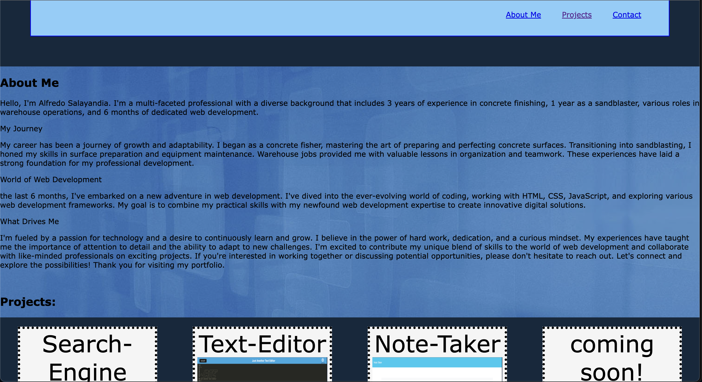

# Module-2-Portfolio

Week-2Challenge (Module-2-Portfolio)

 

## Table of Contents

- [Description](#description)

- [Screenshots](#screenshots)

- [Technologies-Used](#technologies-used)

- [Installation](#installation)

- [Suggested-Future-Development](#suggested-future-development)

- [License](#license)

- [Questions](#questions)

## Description

 Shows my portfolio of projects and contact information for potential employers to view.

## Screenshots

## Technologies Used

html and css 

## Installation

1. Clone the repo:
   git clone https://github.com/Donsidious/Module-2-Portfolio

2. Open in VS Code. If you do not have VS code you must install it.

## Suggested Future Development

- add all of my projects to the portfolio page
- add a contact page
- add a resume page
- add a blog page

## License

NOTICE: This application is covered under the MIT License

## Questions

Have additional questions? Click the links below to reach me through my GitHub account.

[Link to Github](https://github.com/Donsidious)
